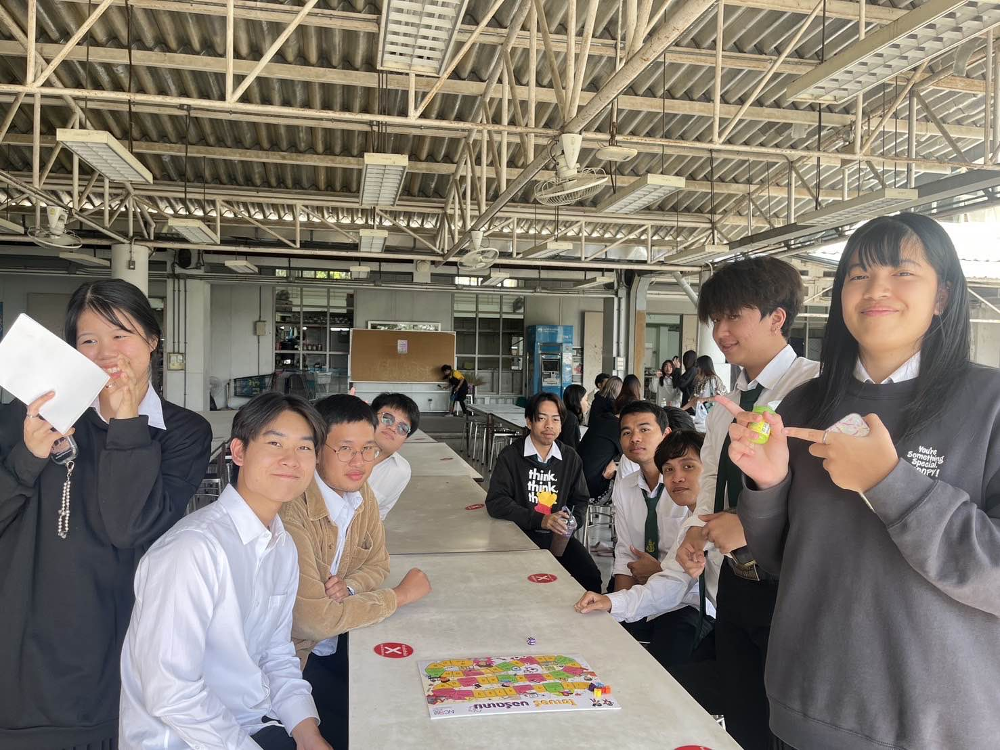

**Board Game**

### บรรยากาศภายในการทำกิจกรรมการเล่นบอร์ดเกมของสำนักงานคณะกรรมการการรักษาความมั่นคงปลอดภัยไซเบอร์แห่งชาติ(สกมช. หรือ NCSA) ###
-----------------------------------------------------

ในการเล่นกิจกรรมบอร์ดเกมพวกเราได้ชวน น้องๆ จากคณะวิทยาศาสตร์มาร่วมเล่นกิจกรรมบอร์ดเกมกับพวกเราอย่างสนุกสนานและเป็นกันเองโดยบอร์ดเกมถูกออกแบบมาให้มีความรู้เกี่ยวกับความปลอดภัยในโลกไซเบอร์แทรกในระหว่างการเล่นเกม โดย ทางกลุ่มผู้จัดทำได้ขออนุญาตแล้ว ในการถ่ายรูป ถ่ายวิดีโอและการเผยแพร่ลงสื่อ Social Media

#### *วันที่ทำกิจกรรม* #####

- วันจันทร์ที่ 13 มกราคม 2568 ณ โรงอาหารของมหาวิทยาลัยวิทยาเขตศรีราชา

#### *รายละเอียดของกิจกรรม* ####

- กิจกรรมนี้่จัดทำโดยกลุ่ม “The Standard” เป็นนิสิต คณะวิทยาศาสตร์ ศรีราชา สาขาวิทยาการคอมพิวเตอร์

- กิจกรรมนี้เป็นการเล่น Board Game ที่เกี่ยวกับการให้ความรู้การป้องกันทางไซเบอร์ ซึ่งเป็นของสำนักงานคณะกรรมการการรักษาความมั่นคงปลอดภัยไซเบอร์แห่งชาติ(สกมช. หรือ NCSA)

- วิธีการเล่นบอร์ดเกมนั้นเหมือนกับการเล่นเกมบรรไดงู โดยถ้าผู้เล่นท๋อยลูกเต๋าแล้วตัวละครของผู้เล่นตกลงในช่อง ‘เขียว’ หรือ ‘แดง’ ทางกรรมการจะอ่านผลลัพท์ของช่องนั้นให้ผู้เล่นฟัง และ อธิบายเนื้อหาของการกระทำทางไซเบอร์ไม่ว่าจะดีหรือไม่ดี

- เกมจะจบลงก้ต่อเมื่อ ผู้เล่นไปถึงที่จุดจบของ Board Game

#### *จุดประสงค์ของกิจกรรม* ####

- เพื่อเสริมสร้างความตระหนักรู้เกี่ยวกับภัยไซเบอร์ให้แก่นักเรียน นักศึกษา และประชาชนทั่วไป

#### *ผู้เล่นที่เข้าร่วมกิจกรรม* ####

- กลุ่มของผู้เล่นที่ได้เข้าร้วมเล่น Board Game ในครั้งนี้คือ น้องๆ คณะวิทยาศาสตร์ ศรีราชา สาขาวิทยาการคอมพิวเตอร์ ชั้นปีที่ 2 น้องจำนวน 3 คน

- คนในกลุ่ม The Standard จำนวน 2 คน

#### *วิดีโอบรรยากาศการเล่นกิจกรรม* ####

---------------------------------------------------------

### สมาชิกในกลุ่ม ###

- [Supakrit Somritjinda](https://jekoflash.github.io/boardGame)

- [Klittima Chaowadee](https://anniemark2522.github.io/boardgame/boardg)

- [Nakorn Tungprapaporn](https://taedate.github.io/boardgame)

- [Natchanan Lordee]()

- [Nonpawit Silabumrungrad]()
