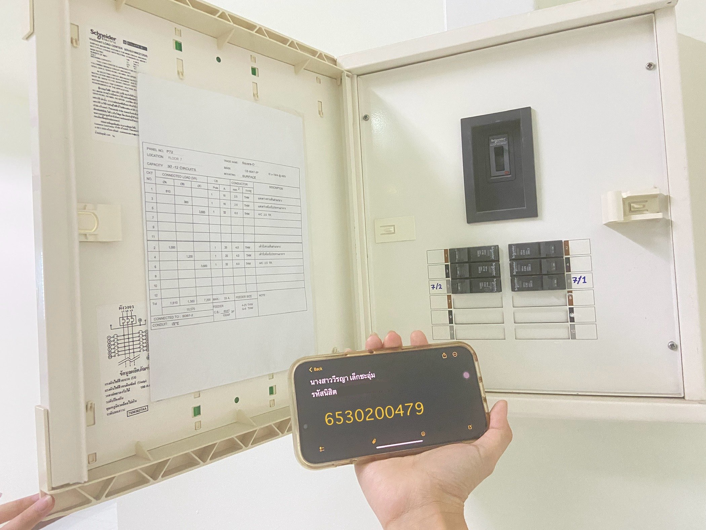

***Security Control in daily life***

📌 การจัดประเภทมาตรการควบคุมด้านความมั่นคงปลอดภัยของตู้ควบคุมไฟ

- Type of Security Controls: ตู้ควบคุมไฟสามารถจัดอยู่ใน 3 ประเภท ได้แก่

  - Physical Controls: จำกัดการเข้าถึง ป้องกันการใช้งานโดยไม่ได้รับอนุญาต
  - Technical Controls: เบรกเกอร์ทำหน้าที่เหมือน Firewall/IPS ป้องกันไฟฟ้าเกินและความเสียหาย
  - Administrative Controls: บันทึกและตรวจสอบข้อมูลการใช้ไฟฟ้า พร้อมแผนรับมือเหตุฉุกเฉิน

  
- Control Function: Corrective → ใช้แก้ไขปัญหาไฟฟ้าขัดข้อง เช่น รีเซ็ตเบรกเกอร์

-----------------------------------------------------------------------------

- สรุป

  
✅ Physical Controls (Preventative & Corrective): ป้องกันและแก้ไขปัญหาผ่านการควบคุมทางกายภาพ

✅ Technical Controls (Preventative & Corrective): เบรกเกอร์ช่วยป้องกันปัญหาเหมือนระบบความปลอดภัยเครือข่าย

✅ Administrative Controls (Detective & Corrective): มีการบันทึกข้อมูลและแผนรับมือปัญหาไฟฟ้า

